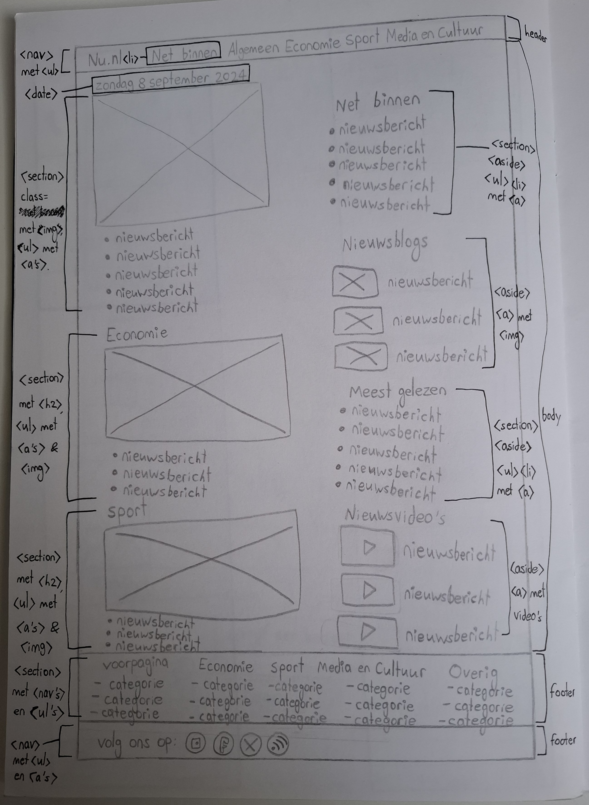
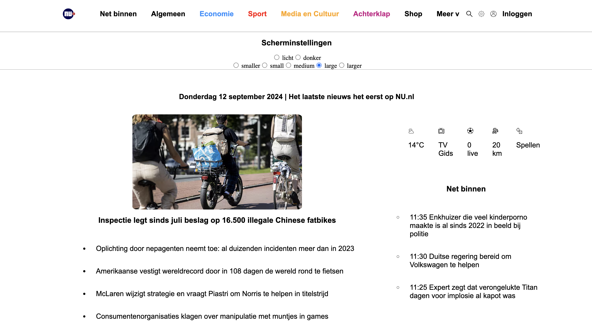

# Procesverslag
Markdown is een simpele manier om HTML te schrijven.  
Markdown cheat cheet: [Hulp bij het schrijven van Markdown](https://github.com/adam-p/markdown-here/wiki/Markdown-Cheatsheet).

Nb. De standaardstructuur en de spartaanse opmaak van de README.md zijn helemaal prima. Het gaat om de inhoud van je procesverslag. Besteedt de tijd voor pracht en praal aan je website.

Nb. Door *open* toe te voegen aan een *details* element kun je deze standaard open zetten. Fijn om dat steeds voor de relevante stuk(ken) te doen.

## Jij

  
uitwerken voor kick-off werkgroep

  ### Auteur:
  Yasmine Hennik (500932421)

  #### Je startniveau:
  Blauw. Mijn startniveau zit momenteel in het blauw. Ik vind coderen erg interessant en leuk om te doen, maar voornamelijk als het lukt. Mijn valkuil is dat ik teveel wil uitproberen in een korte tijd, zonder dat ik overal kennis over heb. Hierdoor kan ik soms gefrustreerd raken en het coderen als iets negatiefs gaan zien. Ik hoop tijdens dit vak door middel van goede uitleg en begeleiding de rust te kunnen bewaren en veel nuttige nieuwe dingen te leren om uiteindelijk een mooie, overzichtelijke website te maken.

  #### Je focus:
  Omdat ik nog een beginner ben met coderen, wil ik me vooral focussen op de surface van een website. Ik ga proberen om alles binnen de site overzichtelijk, maar ook fijn om naar te kijken te maken. Het responsive-gedeelte laat ik liever over aan studenten die er meer verstand van hebben, maar ik ben altijd bereid om mee te kijken met hoe zij dit aanpakken.
 

## Je website

  
uitwerken voor kick-off werkgroep

  ### Je opdracht:
  https://www.nu.nl
  Ik heb voor deze site gekozen, omdat de meeste hier wel mee bekend zullen zijn, want het gaat over het laatste nieuws. Daarnaast ben ik erg benieuwd hoe een site met zoveel verschillende artikelen en updates elke dag toch overzichtelijk blijft. Ik hoop dat ik dit tijdens dit vak kan uitpluizen, want ik denk dat het een sjabloon is wat op allerlei soorten sites kan worden toegepast. 

  #### Screenshot(s) van de eerste pagina (small screen): 
  hier de naam van de pagina  
  

  #### Screenshot(s) van de tweede pagina (small screen):
  hier de naam van de pagina  
  
 

## Toegankelijkheidstest 1/2 (week 1)

  
uitwerken na test in 2e werkgroep

  Tijdens de tweede werkgroep van Frontend Development zijn we ons gaan focussen op de toegankelijkheid van de door ons gekozen site en hoe we dit beter kunnen doen bij onze namaak-versie. Er kunnen namelijk speciale hulpmiddelen worden verwerkt in een site, bijvoorbeeld voor slechtziende mensen of gebruikers met een motorische beperking. In de les hebben we dit zelf kunnen ervaren. We konden eerst verschillende brillen met een beperkt zicht passen en daarmee vervolgens dingen uitvoeren op onze laptop. Verder konden we ervaren hoe het is om met minder vingers te typen en ten slotte konden we door middel van elektroden op onze armen spierspasmes simuleren. Dit was voor ons best grappig om even mee te maken, maar voor gebruikers met deze beperkingen is het belangrijk om hier rekening mee te houden.

  Een van de hulpmiddelen die we sowieso in onze site moeten verwerken is een screenreader. Dit is een programma dat alle knoppen, links en geschreven tekst voorleest. Deze had ik gelukkig al standaard op mijn laptop staan, waardoor ik snel kon beginnen aan de eerste test. Tijdens deze test moesten we onze gekozen site laten voorlezen door de screenreader en om vervolgens te controleren of dit overal wel goed ging. In het begin was de screenreader best overweldigend voor mij en wist ik niet precies hoe je een specifiek stuk tekst moest laten voorlezen. Maar daar kwam ik later achter: je kunt gewoon een stuk van de pagina selecteren met je cursor en dat wordt dan als enige voorgelezen. Als je niets selecteerd, werd Nu.nl bij mijvan boven naar beneden helemaal voorgelezen. Ik kan me voorstellen dat er gebruikers zijn die dit niet prettig vinden. Verder viel het me op dat er maar weinig alt-tags ware, zowel bij foto's als afbeeldingen van icoontjes. Als een blinde of slechtziende gebruiker zou je dus nooit kunnen weten wat er op de foto's te zien is of waar de icoontjes voor staan. Dit vond ik best schokkend, aangezien wij al vanaf les 1 bij internetstandaarden hebben geleerd dat dit belangrijk is. Uiteindelijk werkt de screenreader bij Nu.nl grotendeels goed, alleen moet je wel precies weten wat je doet. En daarnaast zijn de twee gebreken die ik net heb genoemd zo groot dat ik de site persoonlijk niet toegankelijk genoeg vind. Ik hoop dit dus uiteindelijk te kunnen verbeteren met mijn namaak-versie.

  ### Bevindingen

  De officiele checklist van The A11Y Project toegepast op NU.nl:

  - Use plain language and avoid figures of speech, idioms, and complicated metaphors: Ja

  - Make sure that button, a, and label element content is unique and descriptive: Nee
   
  - Use left-aligned text for left-to-right (LTR) languages, and right-aligned text for right-to-left (RTL) languages: Ja
 
  - Validate your HTML: Ja

  - Use a lang attribute on the html element: Ja 

  - Provide a unique title for each page or view Nee

  - Ensure that viewport zoom is not disabled: Nee

  - Use landmark elements to indicate important content regions: Ja

  - Ensure a linear content flow: Ja

  - Avoid using the autofocus attribute: Ja

  - Allow extending session timeouts: Nee

  - Remove title attribute tooltips: Nee

  - Make sure there is a visible focus style for interactive elements that are navigated to via keyboard input: Ja

  - Check to see that keyboard focus order matches the visual layout: Ja

  - Remove invisible focusable elements: Nee

  - Make sure that all img elements have an alt attribute: Nee

  - Make sure that decorative images use null alt (empty) attribute values: Nee

  - Provide a text alternative for complex images such as charts, graphs, and maps: Nee

  - For images containing text, make sure the alt description includes the image's text: Nee

  - Use heading elements to introduce content: Ja

  - Use only one h1 element per page or view: Ja

  - Heading elements should be written in a logical sequence: Ja

  - Don't skip heading levels: Ja

  - Use list elements (ol, ul, and dl elements) for list content: Nee

  - Use the a element for links: Ja

  - Ensure that links are recognizable as links: Nee

  - Ensure that controls have :focus states: Ja

  - Use the button element for buttons: Nee

  - Provide a skip link and make sure that it is visible when focused: Ja

  - Identify links that open in a new tab or window: Nee

  - Use the table element to describe tabular data: Nee

  - Use the th element for table headers (with appropriate scope attributes): Nee

  - Use the caption element to provide a title for the table: Nee

  - All inputs in a form are associated with a corresponding label element: Ja

  - Use fieldset and legend elements where appropriate: Nee

  - Inputs use autocomplete where appropriate: Nee

  - Make sure that form input errors are displayed in list above the form after submission: Nee

  - Associate input error messaging with the input it corresponds to: Ja

  - Make sure that error, warning, and success states are not visually communicated by just color: Nee

  - Make sure that media does not autoplay: Nee

  - Ensure that media controls use appropriate markup: Ja

  - Check to see that all media can be paused: Ja

  - Confirm the presence of captions: Nee

  - Remove seizure triggers: Nee

  - Confirm that transcripts are available: Nee

  - Check your content in specialized browsing modes: Nee

  - Increase text size to 200%: Nee

  - Double-check that good proximity between content is maintained: Nee

  - Make sure color isn't the only way information is conveyed: Ja

  - Make sure instructions are not visual or audio-only: Nee

  - Use a simple, straightforward, and consistent layout: Ja

  - Ensure animations are subtle and do not flash too much: Nee

  - Provide a mechanism to pause background video: Nee

  - Make sure all animation obeys the prefers-reduced-motion media query: Nee

  - Check the contrast for all normal-sized text: Ja

  - Check the contrast for all large-sized text: Ja

  - Check the contrast for all icons: Nee

  - Check the contrast of borders for input elements (text input, radio buttons, checkboxes, etc.): Nee

  - Check text that overlaps images or video: Ja

  - Check custom ::selection colors: Ja

  - Check that the site can be rotated to any orientation: Nee

  - Remove horizontal scrolling: Nee

  - Ensure that button and link icons can be activated with ease: Ja

  - Ensure sufficient space between interactive items in order to provide a scroll area: Ja

  Lijst met je bevindingen die in de test naar voren kwamen:
  
  - Nu.nl kent ondanks zijn professionaliteit toch wel wat fouten in de code. Bij het inspecteren kwamen er 5 errors, 19 issues en 13 infos naar voren.
  - De verschillende categorieen binnen de navigatiebar hebben allemaal een kleur om ze op te laten vallen. Tussen deze kleuren zit veel contrast, om goed het verschil aan te geven.
  - Verder bevat de site weinig kleur, aangezien van de foto's alleen zwart en wit.
  - Veel elementen binnen de code staan op hidden, zodat de site niet meteen te overweldigend wordt.
  - Voor linkjes wordt het a-element bijna niet gebruikt.

## Breakdownschets (week 1)

  
uitwerken na afloop 3e werkgroep

  ### de hele pagina: 
  
    

  ### dynamisch deel (bijv menu): 
  

  ### wellicht nog een dynamisch deel (bijv filter): 
  

## Voortgang 1 (week 2)

  
uitwerken voor eerste feedbackmomente werkgroep

  
  Tijdens de eerste week van Frontend Development hebben we vooral veel theorie gekregen en zijn we nog maar weinig bezig geweest met de eindopdracht. We hebben vooral veel herhalingen gekregen van vorig jaar, maar dat vond ik juist wel prettig. Het was fijn om de theorie van internetstandaarden en inleiding programmeren opnieuw en van een andere docent te horen. Na de theorie gingen we vaak aan de slag met opdrachten via Codepen. Deze waren best nuttig en een goede manier om alle tot nu toe geleerde onderdelen in de praktijk te oefenen, alleen vond ik de site zelf niet zo prettig om mee te werken. Het was hier en daar lastig om bepaalde code te vinden en ik moest de hele tijd overschakelen van Codepen naar de powerpoint waarin de voorbeelden stonden en weer terug.
  
  Naast de herhaling van de theorie hebben we wat meer geleerd over de problemen die mensen met een beperking kunnen ervaren binnen een website en dat wij dit kunnen oplossen door middel van onze eigen site. Dit was erg leerzaam en interessant, alleen weet ik nog niet hoe we dit in de praktijk moeten doen.

  ### Stand van zaken
  hier dit ging goed & dit was lastig (neem ook screenshots op van delen van je website en code)

  Op het moment voor de eerste feedbacksessie heb ik de header, footer en een groot deel van de main van mijn twee pagina's uitgewerkt in html. De header en footer zijn ook al vormgegeven met css en kloppen bijna helemaal. Ik heb alleen een grote fout gemaakt en ben het gaan ontwerpen op desktop-formaat, terwijl dit op mobiel formaat had gemoeten. De site is dus nu nog helemaal niet responsive, en dit is wel heel belangrijk bij deze opdracht. Ik weet nu ook niet hoe ik dit verder moet oplossen, dus daar zou ik graag advies over willen krijgen bij het feedbackmoment. Ik ben namelijk bang dat ik al mijn opgebouwde css weer moet aanpassen om de site responsive te krijgen.

  Wat wil ik bespreken tijdens de meeting: 
  - Algemene feedback op mijn html & css
  - Is mijn code semantisch en kloppend? Kan het hier en daar korter?
  - Hoe krijg ik de site op dit moment (nog) responsive?

  

  

  

  ### Agenda voor meeting
  samen met je groepje opstellen

  | student 1      | student 2          | student 3    | student 4        |
  | ---            | ---                | ---          | ---              |
  | dit bespreken  | en dit             | en ik dit    | en dan ik dat    |
  | en dat ook nog | dit als er tijd is | nog een punt | dit wil ik zeker |
  | ...            | ...                | ...          | ...              |

  ### Verslag van meeting
  hier na afloop snel de uitkomsten van de meeting vastleggen

  - opdracht met container queries maken & toepassen op eigen site
  - alt-tags iets algemener maken
  - nadenken over toevoegingen voor de site
  - asides toevoegen
  - site nog meer responsive maken dmv media queries

## Voortgang 2 (week 3)

  
uitwerken voor 2e voortgang

  Na de eerste feedbacksessie ben ik verder gegaan met het schrijven van content voor mijn site. Zo heb ik per section op de pagina ook een aside toegevoegd met extra nieuwtjes. Ook heb ik nu wat Javascript verwerkt in de website door middel van een dropdown-menu.Daarnaast heb ik naar aanleiding van de theorie uit de lessen een light&dark-mode toegevoegd. 
  Verder ben ik na gaan denken over de extra opties die ik bij deze opdracht aan de site moet toevoegen. Ik wil sowieso meer hover-effects toevoegen, zowel bij linkjes als bij icoontjes, zodat de site toegankelijker wordt met slechtziende mensen en/of mensen met een screenreader. Ik vind het ook leuk als de site wat vloeiender loopt, ik wil bijvoorbeeld sections in laten faden als de gebruiker daarnaartoe scrollt.

  ### Stand van zaken
  Inmiddels staat alle content die ik nodig heb op beide pagina's, waarvan het grootste gedeelte ook goed is gestyled en lijkt op de officiele site. De asides en tweede pagina moeten nog wel aangepakt worden, dus dat ga ik volgende week doen. Wat erg gelukkig erg meeviel, was het maken van het dropdown-menu. Met wat hulp van mijn klasgenoot Mariska staat die nu keurig netjes in de header verstopt, inclusief kloppende Javascript-code. Het enige wat nog ontbreekt, is een animatie-effect om het allemaal wat soepeler te laten verlopen.
  Hetgene waar ik nog steeds de meeste moeite mee heb, is het responsive-gedeelte van de site. Het is nu wel iets beter dan vorige week, maar nog steeds niet goed genoeg. Maar omdat ik heb gekozen voor het surface-aspect van de opdracht, weet ik ook niet hoe het belangrijk het is om hier nu nog heel veel tijd aan te besteden, in plaats van extra dingen aan de site toevoegen. 

  Wat wil ik bespreken tijdens de meeting: 
  - Algemene feedback op mijn html, css & javascript
  - Advies over het responsive maken van de site en de relevantie daarvan
  - Hoe zorg ik ervoor dat de gebruikers door middel van de tab-knop de site kunnen doorlopen?
  - Welke extra opties kan ik aan de surface toevoegen?

  

  

  

  

  ### Agenda voor meeting
  samen met je groepje opstellen

  | student 1      | student 2          | student 3    | student 4        |
  | ---            | ---                | ---          | ---              |
  | dit bespreken  | en dit             | en ik dit    | en dan ik dat    |
  | en dat ook nog | dit als er tijd is | nog een punt | dit wil ik zeker |
  | ...            | ...                | ...          | ...              |

  ### Verslag van meeting
  hier na afloop snel de uitkomsten van de meeting vastleggen

  - asides iets nauwkeuriger stylen
  - linkjes in de header toevoegen naar de sections, dit kan bediend worden met tab
  - experimenteren met media queries bij de header
  - een eventuele extra: gebruikers kunnen niet alleen de light/dark-mode van de site bepalen, maar ook de lettergrootte

## Toegankelijkheidstest 2/2 (week 4)

  
uitwerken na test in 9e werkgroep

  ### Bevindingen

De officiele checklist van The A11Y Project toegepast op mijn nagemaakte versie van NU.nl:

  - Use plain language and avoid figures of speech, idioms, and complicated metaphors: Ja

  - Make sure that button, a, and label element content is unique and descriptive: Ja
   
  - Use left-aligned text for left-to-right (LTR) languages, and right-aligned text for right-to-left (RTL) languages: Ja
 
  - Validate your HTML: Ja

  - Use a lang attribute on the html element: Ja 

  - Provide a unique title for each page or view. Ja

  - Ensure that viewport zoom is not disabled: Ja

  - Use landmark elements to indicate important content regions: Ja

  - Ensure a linear content flow: Ja

  - Avoid using the autofocus attribute: Ja

  - Allow extending session timeouts: Nee

  - Remove title attribute tooltips: Nee

  - Make sure there is a visible focus style for interactive elements that are navigated to via keyboard input: Ja

  - Check to see that keyboard focus order matches the visual layout: Ja

  - Remove invisible focusable elements: Nee

  - Make sure that all img elements have an alt attribute: Ja

  - Make sure that decorative images use null alt (empty) attribute values: Nee

  - Provide a text alternative for complex images such as charts, graphs, and maps: Nee

  - For images containing text, make sure the alt description includes the image's text: Ja

  - Use heading elements to introduce content: Ja

  - Use only one h1 element per page or view: Ja

  - Heading elements should be written in a logical sequence: Ja

  - Don't skip heading levels: Ja

  - Use list elements (ol, ul, and dl elements) for list content: Ja

  - Use the a element for links: Ja

  - Ensure that links are recognizable as links: Ja

  - Ensure that controls have :focus states: Ja

  - Use the button element for buttons: Nee

  - Provide a skip link and make sure that it is visible when focused: Ja

  - Identify links that open in a new tab or window: Nee

  - Use the table element to describe tabular data: Nee

  - Use the th element for table headers (with appropriate scope attributes): Nee

  - Use the caption element to provide a title for the table: Nee

  - All inputs in a form are associated with a corresponding label element: Ja

  - Use fieldset and legend elements where appropriate: Nee

  - Inputs use autocomplete where appropriate: Nee

  - Make sure that form input errors are displayed in list above the form after submission: Nee

  - Associate input error messaging with the input it corresponds to: Ja

  - Make sure that error, warning, and success states are not visually communicated by just color: Nee

  - Make sure that media does not autoplay: Nee

  - Ensure that media controls use appropriate markup: Ja

  - Check to see that all media can be paused: Ja

  - Confirm the presence of captions: Nee

  - Remove seizure triggers: Ja

  - Confirm that transcripts are available: Nee

  - Check your content in specialized browsing modes: Ja

  - Increase text size to 200%: Ja

  - Double-check that good proximity between content is maintained: Ja

  - Make sure color isn't the only way information is conveyed: Ja

  - Make sure instructions are not visual or audio-only: Nee

  - Use a simple, straightforward, and consistent layout: Ja

  - Ensure animations are subtle and do not flash too much: Ja

  - Provide a mechanism to pause background video: Nee

  - Make sure all animation obeys the prefers-reduced-motion media query: Nee

  - Check the contrast for all normal-sized text: Ja

  - Check the contrast for all large-sized text: Ja

  - Check the contrast for all icons: Ja

  - Check the contrast of borders for input elements (text input, radio buttons, checkboxes, etc.): Ja

  - Check text that overlaps images or video: Ja

  - Check custom ::selection colors: Ja

  - Check that the site can be rotated to any orientation: Nee

  - Remove horizontal scrolling: Ja

  - Ensure that button and link icons can be activated with ease: Ja

  - Ensure sufficient space between interactive items in order to provide a scroll area: Ja

  Lijst met je bevindingen die in de test naar voren kwamen (geef ook aan wat er verbeterd is):

  - 

## Voortgang 3 (week 4)

  
uitwerken voor 3e voortgang

  De laatste week om aan deze opdracht te werken begon met goede moed. Ik heb de asides aangepast om zoveel mogelijk op die van NU.nl zelf te laten lijken. Verder heb ik mijn tweede pagina met uitgelichte video's gestyled. Ik heb daarnaast wat extra opties toegevoegd, zoals een kleine animatie bij het hoveren over icoontjes. Hierbij heb ik ook voor een aparte kleur met veel contrast gekozen die bij alle hover-effecten te zijn zal zijn. Ook heb ik alle sections een eigen achtergrondkleur gegeven, zodat het nu makkelijk te zien is welke onderwerpen en asides er bij elkaar horen. Dit is iets waar ik me bij NU.nl zelf wel eens aan erger. Ook heb ik mijn light&dark-modus wat verbeterd, waardoor deze nu optimaal werkt. Daarbij heb ik ook de optie toegevoegd om de lettergrootte aan te passen, naar aanleiding van het advies van Kim. Ten slotte staan er nu ook daadwerkelijke linkjes in de header, zodat de site nog ook met de tab-toets bestuurd kan worden. 
  Ondanks al deze aanpassingen en verbeteringen heb ik nu wel 1 groot probleem: de sections & asides op de site staan helemaal niet gecentreerd, terwijl ik alles heb geprobeerd. Hierdoor is het kleine beetje responsiveness dat de site had ook helemaal verdwenen.

  ### Stand van zaken
  hier dit ging goed & dit was lastig (neem ook screenshots op van delen van je website en code)

  Ik ben nu erg tevreden met alle ontwikkelingen die ik deze week heb verwerkt in de site. Alleen ben ik op dit moment, vlak voor de laatste feedbacksessie best onzeker over mijn site. Ik twijfel namelijk of dit wel genoeg is om een voldoende of uberhaupt het vak te halen. De site heeft (bijna) alle content en styling van de oorspronkelijke site, maar is niet responsive en heeft geen mooie gecentreerde tekst. Ik heb heel veel verschillende dingen geprobeerd om dit op te lossen, zoals media & container queries, display flex & grid, justify content, justify-items & justify-self, maar niks heeft gewerkt. Ik heb mijn klasgenoot Diego er nog naar laten kijken, maar ook hij weet niet hoe dit kan. Daarnaast vind ik de opties die ik heb toegevoegd wel leuk, maar ook niet heel bijzonder. Ik ben dus van plan om wel mijn zorgen te uiten tijdens het feedbackmoment en te vragen hoe ik dit vak nog netjes kan afronden.

  Wat wil ik bespreken tijdens de meeting: 
  - Algemene feedback op mijn html, css & javascript
  - Vragen naar een oplossing voor het responsiveness-probleem
  - Vragen naar een oplossing voor het centratie-probleem
  - Advies voor nog meer extra opties om te conpenseren
  - Is dit wel genoeg om het vak te halen?

  

  

  

  

  ### Agenda voor meeting
  samen met je groepje opstellen

  | student 1      | student 2          | student 3    | student 4        |
  | ---            | ---                | ---          | ---              |
  | dit bespreken  | en dit             | en ik dit    | en dan ik dat    |
  | en dat ook nog | dit als er tijd is | nog een punt | dit wil ik zeker |
  | ...            | ...                | ...          | ...              |

  ### Verslag van meeting
  hier na afloop snel de uitkomsten van de meeting vastleggen

  - Website veranderen naar mobiel scherm in plaats van desktop scherm
  - Afbeeldingen een vaste grootte geven
  - Light/darkmode & lettergrootte los van elkaar zetten

## Eindgesprek (week 5)

  
uitwerken voor eindgesprek

  Tijdens het laatste feedbackgesprek en het eindgesprek heb ik de code van mijn site helemaal overhoop gehaald en veranderd. Ik ben er bij het feedbackmoment achter gekomen dat de site op dat moment niet goed genoeg was en dat ik niet zo door kon gaan. Ik heb vervolgens de hele indeling veranderd, zodat de site op een mobiel scherm past, in plaats van op een desktop. Hierdoor was het ook makkelijker om de site responsive te maken, en uiteindelijk schaalt nu alles - zolang het maar binnen een mobiel scherm is - mooi mee. Verder heb ik wat onderdelen weggelaten, omdat mijn vorige ontwerp veel te lang was en daardoor de code onoverzichtelijk. De site bestaat nu alleen uit het laatste nieuws met daaronder de asides. Deze staan nu allemaal netjes onder elkaar met genoeg ruimte ertussen.
  Qua toevoegingen aan de surface is het grotendeels hetzelfde gebleven. Gebruikers kunnen nog steeds via de links naar andere sections op de pagina springen, er is een dropdown-menu en een unieke hover-kleur om aan te geven wat een link is en wat niet. De icoontjes en knoppen hebben nu wel een achtergrondkleur gekregen om ze meer op knoppen te laten lijken, maar ook omdat ze niet goed zichtbaar waren in de darkmode. De radiobuttons voor de scherminstellingen staan nu netjes in het midden en hebben dezelfde kleur als de hover, en bij het veranderen van de tekstgrootte staan deze ook mooier gepositioneerd. Ten slotte heb ik nog een banner toegevoegd met een h1-tag, omdat deze bij NU.nl zelf ontbreekt, en nog een unieke animatie.

  ### Je uitkomst - karakteristiek screenshots:
  
  
  

  ### Dit ging goed/Heb ik geleerd: 
  Hoewel ik in eerste instantie best gestresst raakte van het feit dat ik de site drastisch moest aanpassen, ben ik toch blij dat ik deze keuze heb gemaakt. De site is nu veel prettiger om naar te kijken, maar ook gebruiksvriendelijk vanwege de responsiveness, het optie om de tekstgrootte te veranderen en de nieuwe knoppen. Verder ben ik ook erg te spreken over de animaties, en de manier waarop het dropdown-menu en de footer ingedeeld zijn. Maar het belangrijkste van deze ervaring vind ik, dat ik nu meer vertrouwen heb in mijn codeervaardigheden en ik binnen een korte termijn toch een bijna geheel nieuwe site uit de grond kan werken.

  
  
  

  ### Dit was lastig/Is niet gelukt:
  Tijdens het coderen heb ik nog het meeste moeite gehad met het centreren van content, op sommige plekken was dit gewoon niet mogelijk. Daarnaast duurde het ook een tijd voordat mijn dropdown-menu werkend was. Pas na het raadplegen van ChatGPT zag ik waar de fout zat, de link naar het Javascript-bestand stond niet op de goede plek. Tot slot zijn er natuurlijk nog dingen die ik extra had willen doen, maar er de tijd niet voor had, zoals meer animaties, het leren gebruiken van media queries en de html:has-functie in meer detail toepassen.
  Dit is iets wat ik graag anders had willen doen en zeker nog in de toekomst wil leren. 

  

## Bronnenlijst

  
continu bijhouden terwijl je werkt

  Nb. Wees specifiek ('css-tricks' als bron is bijv. niet specifiek genoeg). 
  Nb. ChatGpT en andere AI horen er ook bij.
  Nb. Vermeld de bronnen ook in je code.

  1. Ten eerste ben ik goed geholpen door Ivo en de drie studentassistenten
  2. Verder hebben mijn klasgenoten Diego en Mariska ook soms geholpen als ik vastliep.
  3. Om te controleren of dingen klopten, heb ik hier en daar gebruik gemaakt van ChatGPT.
  4. Qua algemene bronnen heb ik vooral gebruik gemaakt van W3Schools, CSS Tricks, GeeksforGeeks, SheCodes, Quora & Stack Overflow
  5. Alle SVG'tjes zijn afkomstig van: https://www.svgrepo.com/vectors/
  6. Om de link naar de hompage in het logo te zetten, heb ik https://www.tutorialspoint.com/how-to-use-an-image-as-a-link-in-html gebruikt
  7. Om binnen 1 pagina naar een andere section te gaan heb ik deze tutorial gebruikt: https://www.youtube.com/watch?v=8c4CA8MTZvU
  8. Voor het maken van de radio buttons bij de scherminstellingen heb ik deze powerpoint van DLO gebruikt: https://dlo.mijnhva.nl/content/enforced/609314-FDMCI-2000FED121-DMCI-CMD-2425/FED%2024-25%20-%20Blok%201%20-%20Intro%20kleurtjes%20met%20has%20en%20lightdark.pdf
  9. Bij het dropdown-menu linken aan Javascript ben ik geholpen door Mariska
  10. Om te ontdekken wat mijn fout was bij mijn Javascript-bestand, heb ik ChatGPT om hulp te gevraagd.
  11. Om de kleur van de geselecteerde radio buttons te veranderen heb ik deze bron gebruikt: https://www.tutorialspoint.comhow-to-change-the-color-of-the-radio-button-using-css
  12. Voor de animatie in de banner heb ik deze YouTube-tutorial geraadgepleegd: https://www.youtube.com/watch?v=xqKrVvA48E4

